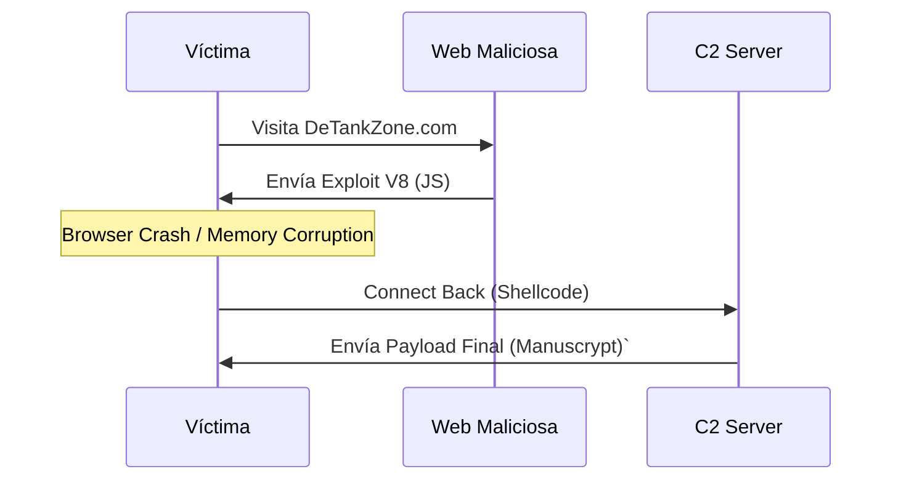

La campaña DeTankZone implementó una cadena de ataque sofisticada que abarcó desde el reconocimiento inicial hasta la instalación de malware persistente. Este análisis descompone la operación en las siete fases del modelo Cyber Kill Chain de Lockheed Martin.

## 2.1. Fase de Reconocimiento

Lazarus Group realizó un reconocimiento dirigido del sector criptomonedas para identificar objetivos de alto valor y planificar vectores de ataque efectivos.

**Objetivos identificados:**

* Inversores activos en criptomonedas con holdings significativos
* Influencers y figuras públicas del sector crypto
* Traders profesionales con acceso a exchanges y wallets
* Early adopters de tecnologías DeFi/NFT

El perfilado de víctimas incluyó análisis de presencia en redes sociales, participación en comunidades crypto, y patrones de actividad que indicaran capacidad económica y conocimientos técnicos en blockchain. Esta fase permitió a los atacantes diseñar el señuelo (juego DeFi/NFT) específicamente adaptado a los intereses del público objetivo.

## 2.2. Fase de Preparación (Weaponization)

La preparación involucró múltiples componentes técnicos y de infraestructura desarrollados o adquiridos durante varios meses previos al lanzamiento de la campaña.

**Componentes técnicos desarrollados:**

* Exploit chain combinando [CVE-2024-4947](https://www.incibe.es/incibe-cert/alerta-temprana/vulnerabilidades/cve-2024-4947) y bypass de sandbox V8
* Validator script (shellcode) para fingerprinting de sistemas
* Backdoor Manuscrypt adaptado para la campaña
* Loader personalizado YouieLoad para despliegue de payloads

**Infraestructura preparada:**

* Registro del dominio `detankzone[.]com` (febrero 2024)
* Dominio secundario `ccwaterfall[.]com` para infraestructura adicional
* Servidores de Command and Control (C2) para comunicación con malware
* Múltiples cuentas en redes sociales (X/Twitter, LinkedIn) creadas con meses de antelación

**Robo del código fuente DeFiTankLand:** Un aspecto crítico de la preparación fue el compromiso del proyecto legítimo DeFiTankLand (DFTL) en marzo 2024. Lazarus robó 20,000 dólares en tokens DFTL2 junto con el código fuente completo del juego. Este código fue posteriormente modificado y rebrandeado como DeTankZone, proporcionando un señuelo completamente funcional que redujo sospechas.

**Generación de contenido con IA:** Los atacantes utilizaron herramientas de inteligencia artificial generativa para crear contenido promocional de alta calidad, incluyendo gráficos, descripciones del juego, y material para redes sociales. Esto proporcionó apariencia profesional y legitimidad al proyecto falso.

## 2.3. Fase de Entrega (Delivery)

La entrega combinó múltiples vectores de ataque para maximizar el alcance y probabilidad de compromiso exitoso.

**Vector web principal - Drive-by Download:** El sitio `detankzone[.]com` funcionó como vector primario de infección. La simple visita al sitio con Chrome vulnerable era suficiente para desencadenar el exploit, sin requerir interacción adicional del usuario (descarga de archivos, clicks en enlaces, etc.). Este ataque de tipo "watering hole" pasivo maximizó las infecciones al reducir la barrera de entrada.

**Campañas de ingeniería social:**

1. **Redes sociales (X/Twitter):** Múltiples cuentas promocionaron activamente DeTankZone durante meses, construyendo presencia orgánica mediante posts regulares, interacción con la comunidad crypto, y creación de expectativa sobre el lanzamiento del juego.
2. **LinkedIn:** Perfiles profesionales se acercaron a figuras influyentes del sector blockchain y criptomonedas, presentándose como desarrolladores del proyecto o inversores interesados, solicitando feedback o colaboración.
3. **Spear-phishing:** Emails dirigidos a individuos específicos, personalizados según el perfil de la víctima, promocionando el juego o solicitando inversión/partnership.
4. **Mensajería directa:** Contacto directo a través de plataformas de mensajería (Telegram, Discord) con miembros prominentes de comunidades crypto.

**Suplantación de identidad:** Los atacantes se presentaron como representantes legítimos de empresas blockchain, desarrolladores de juegos buscando inversión, o representantes de fondos de capital riesgo interesados en proyectos DeFi. Esta táctica aprovechó la cultura de networking activa del sector crypto.

## 2.4. Fase de Explotación

La explotación se ejecutó automáticamente mediante la cadena de exploits descrita en la sección de [[03 - Análisis de Vulnerabilidades Explotadas]], sin requerir interacción del usuario.

**Secuencia de explotación automatizada:**

1. Víctima accede a `detankzone[.]com` con Chrome vulnerable
2. Script JavaScript ofuscado se carga y ejecuta automáticamente
3. Trigger de [CVE-2024-4947](https://www.incibe.es/incibe-cert/alerta-temprana/vulnerabilidades/cve-2024-4947) mediante objetos JavaScript maliciosos
4. Establecimiento de primitivas de lectura/escritura arbitrarias
5. Bypass de ASLR mediante filtración de direcciones
6. Explotación de vulnerabilidad de bypass de sandbox V8
7. Escape del sandbox y obtención de capacidades de ejecución de código nativo

El tiempo total desde visita a la página hasta obtención de RCE en el sistema operativo era de segundos, ejecutándose completamente en background sin indicadores visibles para la víctima. El juego presentado en el sitio servía como distracción mientras el exploit operaba.

## 2.5. Fase de Instalación

Una vez lograda la ejecución de código en el sistema operativo, la campaña procedió con una instalación selectiva basada en el valor de la víctima.

**Ejecución del Validator Script:** El primer payload ejecutado fue un validator script (shellcode) diseñado para recopilar información del sistema comprometido:

* Configuración de hardware y sistema operativo
* Software instalado, especialmente aplicaciones relacionadas con criptomonedas
* Presencia de wallets de criptomonedas (software wallets, extensiones de navegador)
* Volumen estimado de archivos y datos sensibles
* Presencia de software de seguridad (antivirus, EDR)
* Configuración de red y conectividad

Esta información se exfiltraba a los servidores de los atacantes para evaluación. El enfoque selectivo permitía a Lazarus optimizar recursos, desplegando malware adicional solo en sistemas que justificaran el esfuerzo y riesgo de detección.

**Despliegue condicional de Manuscrypt:** En sistemas evaluados como valiosos, se procedía con la instalación del backdoor Manuscrypt. El deployment incluía:

* Descarga del payload Manuscrypt desde infraestructura C2
* Instalación con mecanismos de persistencia (startup entries, scheduled tasks)
* Configuración de comunicación con servidores C2
* Establecimiento de canales encriptados para exfiltración de datos

**Uso del loader YouieLoad:** Para víctimas que descargaron el archivo `detankzone.zip` (juego completo), se utilizó el loader personalizado YouieLoad integrado en el ejecutable del juego. Este loader proporcionaba un vector de instalación alternativo, ejecutándose cuando el usuario lanzaba el juego descargado y complementando o reemplazando la infección vía exploit web.

## 2.6. Fase de Command and Control

La infraestructura de C2 permitió a Lazarus mantener comunicación persistente con sistemas comprometidos, aunque los detalles específicos están limitados debido al desmantelamiento de la infraestructura en el momento del descubrimiento.

**Características conocidas del C2:**

* Protocolo de comunicación encriptado para evadir inspección de tráfico
* Beaconing periódico desde Manuscrypt para mantener conexión activa
* Capacidad de recibir comandos remotos y actualizar payloads
* Exfiltración de datos robados a través de canales encriptados
* Arquitectura distribuida utilizando múltiples dominios y servidores

Para mayo 2024, cuando la campaña fue descubierta, la infraestructura backend del juego había sido desmantelada por los atacantes, sugiriendo que Lazarus detectó el escrutinio o completó su operación objetivo.

## 2.7. Fase de Acciones sobre Objetivos

La fase final involucró la explotación de los sistemas comprometidos para cumplir los objetivos de la campaña: robo de criptomonedas e información sensible.

**Robo de activos de criptomonedas:**

* Extracción de private keys y seed phrases de wallets software
* Robo de credenciales de exchanges de criptomonedas
* Captura de cookies de sesión para acceso a cuentas de trading
* Monitorización de transacciones para identificar holdings significativos

**Exfiltración de información sensible:**

* Tokens de autenticación y cookies de sesión del navegador
* Credenciales almacenadas en Chrome y otros navegadores
* Historial de navegación relacionado con actividades crypto
* Documentos y archivos relacionados con inversiones y finanzas
* Información de contactos para potenciales ataques de seguimiento

**Capacidades de Manuscrypt para acciones extendidas:** El backdoor instalado proporcionaba capacidades adicionales para operaciones de largo plazo:

* Ejecución remota de comandos arbitrarios
* Descarga y ejecución de herramientas adicionales
* Establecimiento de túneles para movimiento lateral en redes corporativas
* Actualización del malware para evadir detección
* Mantenimiento de acceso persistente para futuras operaciones

El payload final exacto desplegado después del validator script no fue completamente documentado en los análisis públicos, sugiriendo que varió según el perfil de cada víctima o que ciertos componentes permanecen sin identificar.